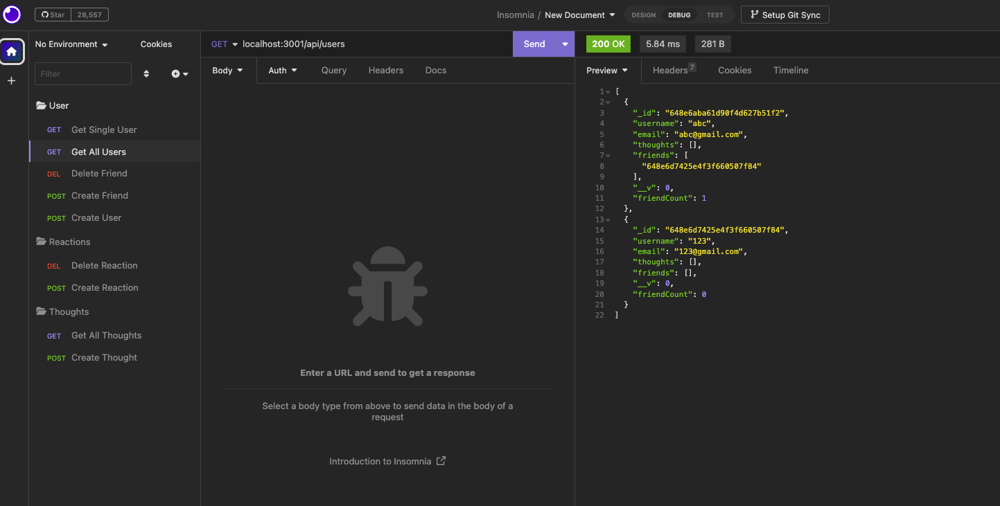
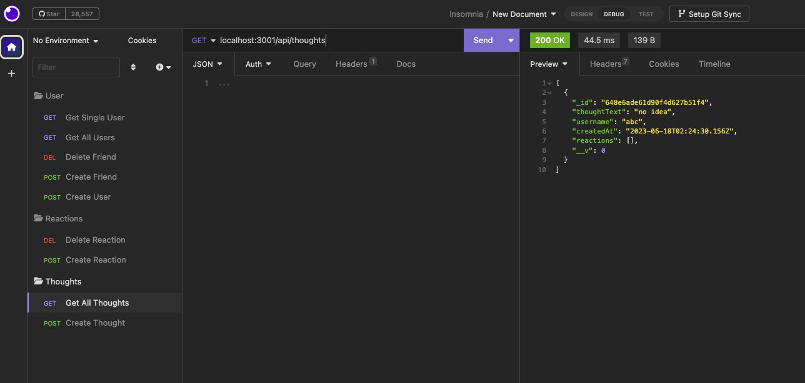
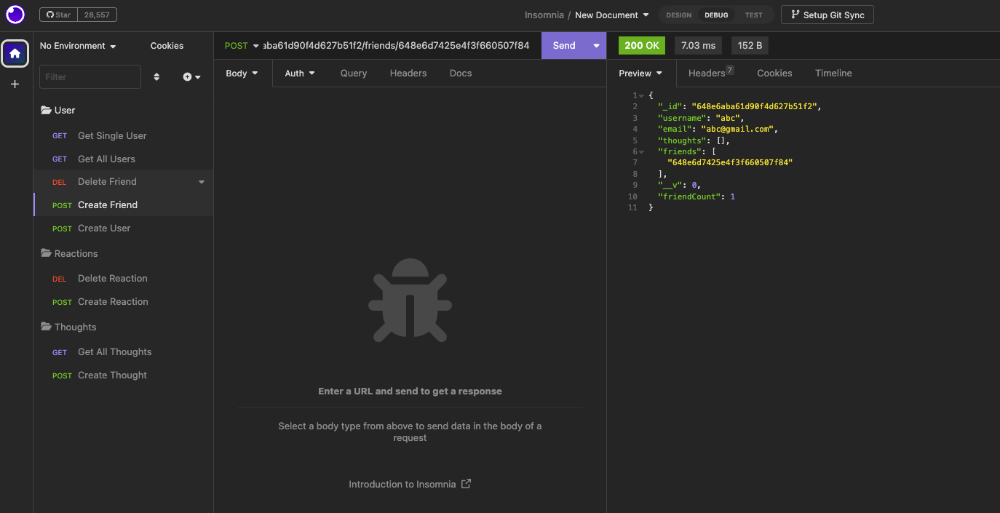
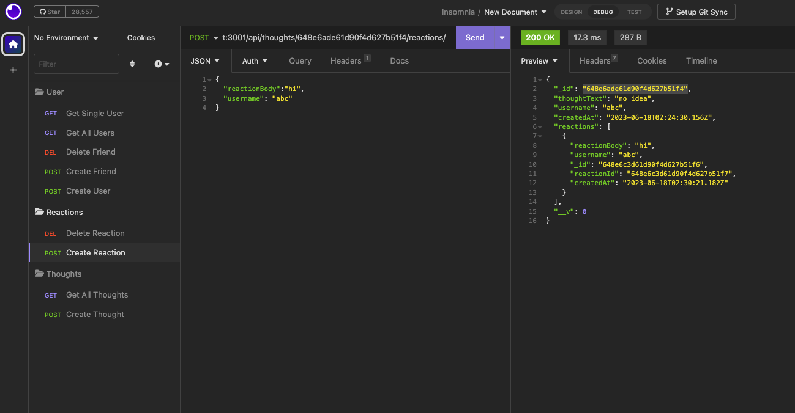

# Social Network API

## Table of Contents

- [Description of the Project](#description)
- [Installation](#installation)
- [Screenshot](#screenshot)
- [Links](#links)
- [License](#license)

## Description

This is an API for a social network web application where users can share their thoughts, react to friends’ thoughts, and create a friend list. It uses Express.js for routing, a MongoDB database, and the Mongoose ODM.

## Installation

- Install Express.js package
- Uses the Mongoose package to connect to a MongoDB database.

## Screenshot

## Links

- GitHub: https://github.com/Chenson92/Social-Network-API
- WalkThrough Video:https://drive.google.com/file/d/1C2WYTf_gZu3l1BUIwkHCP-oXbr6GZKI-/view

## License

This project is licensed under the terms of the MIT license.
[License](https://opensource.org/licenses/MIT)
